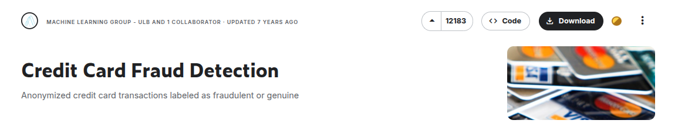
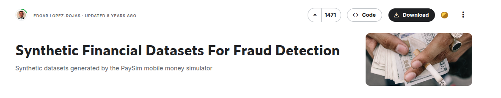
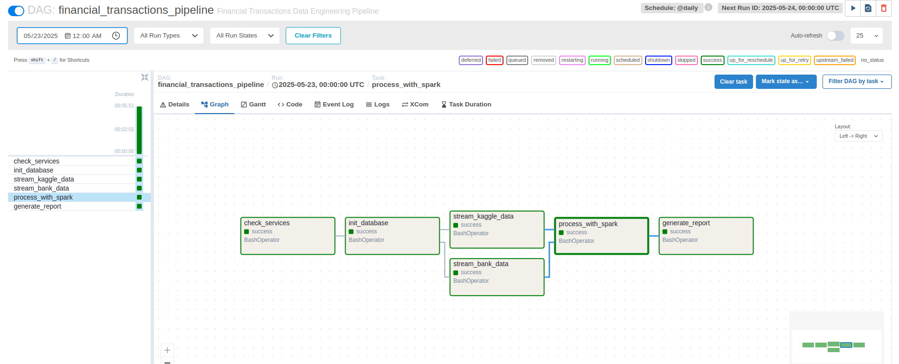
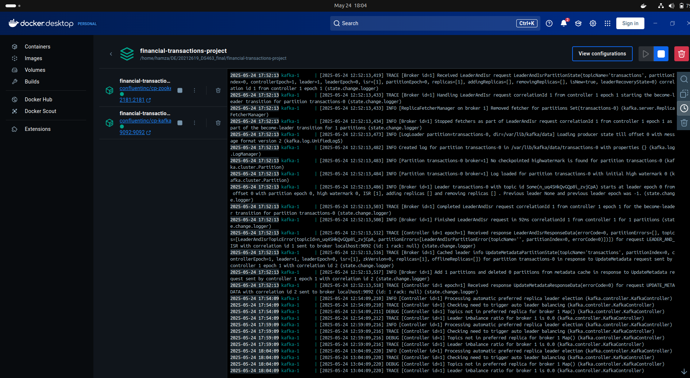
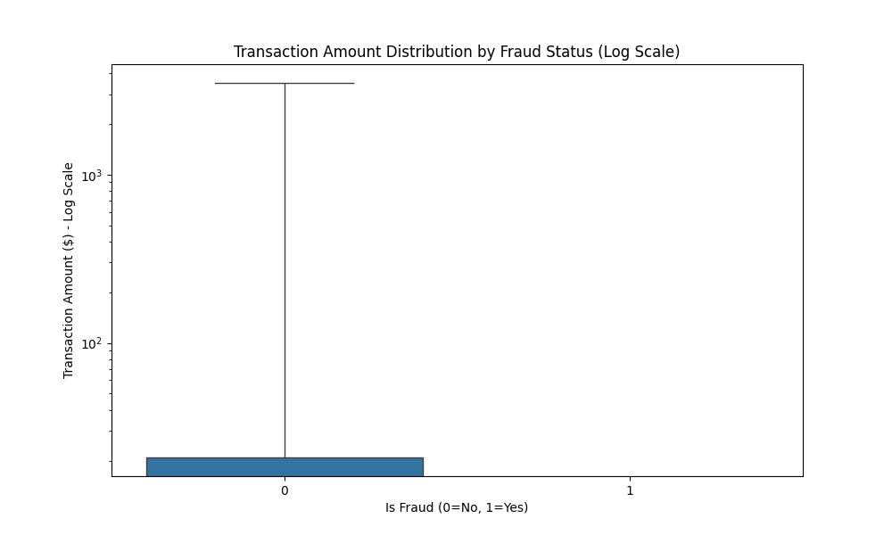
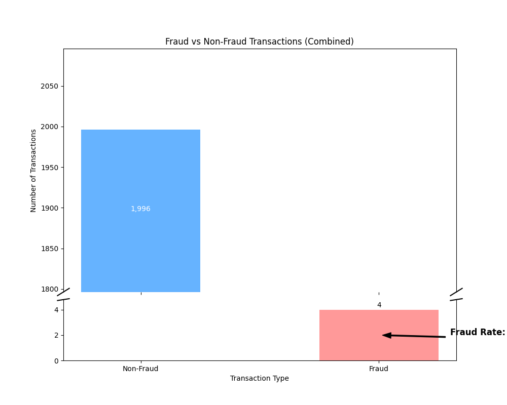
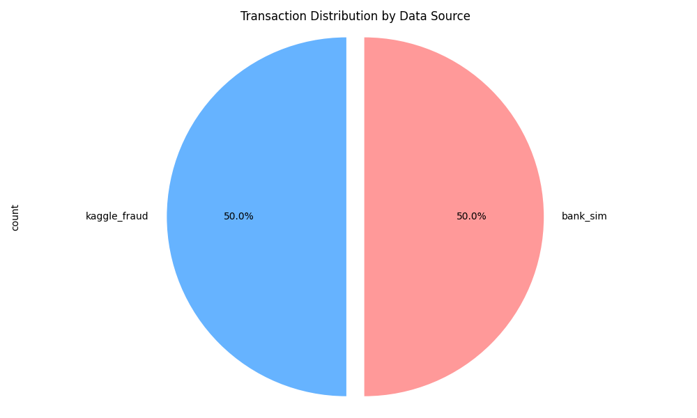
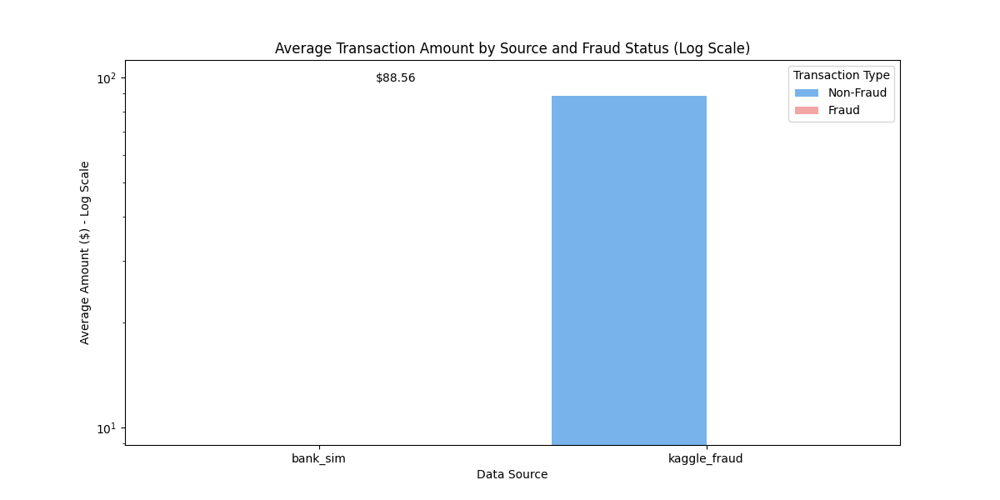

# Financial Transactions Fraud Analysis - Data Engineering Project

## Problem Statement
This project implements a comprehensive data engineering pipeline for processing financial transaction data to detect fraudulent activities. The system ingests data from multiple sources, processes it in real-time, and provides insights into fraudulent transaction patterns.

## Dataset Description
The project utilizes two distinct datasets:
1. **Kaggle Credit Card Fraud Dataset**: Contains transactions made by credit cards with features transformed using PCA for privacy. The 'Class' feature indicates whether a transaction is fraudulent (1) or not (0).

   *Sample visualization from the Kaggle dataset:*
   <br>
   

2. **Bank Simulation Dataset**: Simulated bank transactions with various transaction types and fraud indicators.

   *Sample visualization from the Bank Simulation dataset:*
   <br>
   

## Justification for the Chosen Problem
Financial fraud detection is a critical application of data engineering for several reasons:
- Real-time detection is essential to minimize financial losses
- The problem requires handling large volumes of transaction data
- Multiple data sources need to be integrated and standardized
- Complex data processing and analytics are needed to identify patterns
- The solution demonstrates practical applications of data engineering concepts

## Project Structure

```
financial-transactions-project/
│
├── dags/                       # Airflow DAG definitions
│   └── transaction_pipeline_dag.py
│
├── kafka/                      # Kafka producers
│   ├── producer1.py            # Producer for Kaggle fraud dataset
│   └── producer2.py            # Producer for bank simulation dataset
│
├── spark/                      # Spark processing scripts
│   └── consumer_mysql.py       # Spark consumer that processes Kafka data and writes to MySQL
│
├── sql/                        # SQL scripts
│   └── create_mysql_tables.sql # Script to create MySQL tables
│
├── reports/                    # Output reports
│   └── fraud_report_20250524.html    
│
├── Project_Report.ipynb        # Deatiled Project Report and Results
├── docker-compose.yml          # Docker configuration for services
└── kafka-docker-compose.yml    # Kafka-specific Docker configuration
```

## Technologies Used

- **Apache Kafka**: For real-time data streaming
- **Apache Spark**: For data processing and transformation
- **MySQL**: For data storage
- **Apache Airflow**: For workflow orchestration
- **Docker**: For containerization and deployment
- **Python**: Primary programming language
- **Pandas & Matplotlib**: For data analysis and visualization

## Pipeline Overview

1. **Data Ingestion**: Two Kafka producers stream data from different sources:
   - Credit card transaction data from Kaggle
   - Simulated bank transaction data

2. **Data Processing**: Spark streaming job consumes data from Kafka, processes it, and:
   - Standardizes the schema across different data sources
   - Detects potential fraudulent transactions
   - Generates transaction summaries

3. **Data Storage**: Processed data is stored in MySQL:
   - Detailed transaction records
   - Aggregated transaction summaries

4. **Orchestration**: Airflow DAG orchestrates the entire pipeline:
   - Checks if required services are running
   - Initializes the database if needed
   - Triggers data streaming
   - Processes data with Spark
   - Generates reports

*Below is a visual representation of the Airflow DAG orchestrating the pipeline:*
<br>


*The Airflow dashboard provides a clear overview of the pipeline's status:*
<br>


## How to Run

1. Start the Docker containers:
   ```
   docker-compose up -d
   ```

2. Access Airflow UI:
   ```
   http://localhost:8081
   ```

3. Trigger the DAG:
   - Navigate to the Airflow UI
   - Enable and trigger the `financial_transactions_pipeline` DAG

4. View the generated reports in the `reports` directory

## Implementation Details

- The Spark consumer handles both datasets by using a flexible schema that can accommodate different field structures.
- Transactions are standardized into a common format for consistent processing.
- Fraud detection is based on the 'Class' or 'isFraud' fields from the respective datasets.
- Summary statistics are generated to provide insights into transaction patterns and fraud occurrences.

*The Docker setup simplifies deployment and ensures reproducibility:*
<br>


## Data Analysis & Results

Below are some key visualizations generated from the processed data:

**Distribution of Transaction Amounts (Log Scale):**
<br>


**Fraudulent vs. Non-Fraudulent Transactions:**
<br>


**Distribution of Transactions by Source:**
<br>


**Average Transaction Amount by Source and Fraud Status:**
<br>


## Academic Integrity Statement

This project is my original work, completed as part of the Data Engineering course requirements. I have properly cited all external resources and libraries used in this project, as listed below:

### Libraries and Resources Used:
- Apache Kafka (https://kafka.apache.org/)
- Apache Spark (https://spark.apache.org/)
- Apache Airflow (https://airflow.apache.org/)
- MySQL (https://www.mysql.com/)
- Docker (https://www.docker.com/)
- Python Libraries: pandas, matplotlib, seaborn, pyspark
- Kaggle Credit Card Fraud Dataset (https://www.kaggle.com/mlg-ulb/creditcardfraud)

## Bash Commands for environment setup and initializations:

(airflow_env) hamza@hamza-Nitro-AN515-45:~/DE/20212619_DS463_final/financial-transactions-project$ docker compose -f kafka-docker-compose.yml up -d
(airflow_env) hamza@hamza-Nitro-AN515-45:~/DE/20212619_DS463_final/financial-transactions-project$ docker compose -f kafka-docker-compose.yml down

airflow standalone

(airflow_env) hamza@hamza-Nitro-AN515-45:~/DE/20212619_DS463_final/financial-transactions-project$ python -c "from kafka import KafkaProducer; producer = KafkaProducer(bootstrap_servers='localhost:9092'); print('Connection successful')"

sudo systemctl start mysql

(airflow_env) hamza@hamza-Nitro-AN515-45:~/DE/20212619_DS463_final/financial-transactions-project$ python /home/hamza/DE/20212619_DS463_final/financial-transactions-project/scripts/generate_report.py
